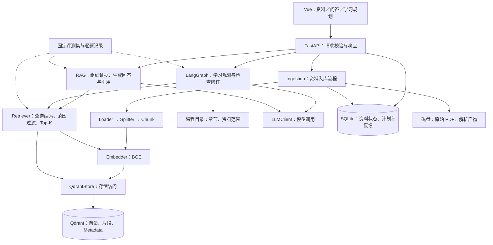

# AI Course Assistant：项目总设计与指导依据

规划版本：v2，2026-09-17。本文是目标、模块职责与技术选择的统一依据；时间安排见 [ROADMAP.md](ROADMAP.md)，实际进度见 [DEVELOPMENT_LOG.md](DEVELOPMENT_LOG.md)，实验见 [EXPERIMENT_RECORD.md](EXPERIMENT_RECORD.md)。新聊天先按 [文档导航](README.md) 阅读。

## 1. 一句话说明项目

面向大学课程资料，开发一个可在服务器访问的学习助手：提供有来源证据的课程问答，以及基于课程内容、学习目标和时间预算的学习计划。

目标用户首先是项目作者本人和复试演示者。第一版为单用户／受控演示应用，验证一门主课程，不建设开放的多人教学平台。

开发约三到四个月，每天约四小时。目标是能够独立讲清系统架构、RAG 原理、LangGraph 编排、工程取舍与实验结果。项目价值 > 功能数量；技术理解 > 快速实现；可解释性 > 黑盒调用；长期成长 > 短期效果。

## 2. 最终产品是什么

### 2.1 三个主要页面

| 页面 | 用户操作 | 应看到的结果 | 验收例子 |
|---|---|---|---|
| 课程资料 | 选择课程，上传文本型 PDF，查看资料及章节 | 文件处理状态、来源页码、可用课程目录 | 上传成功后可检索；空文本或失败文件明确提示 |
| 课程问答 | 输入问题，可指定章节 | 回答、引用片段、文件与 PDF 页码；证据不足时说明限制 | 问“补码为什么能实现减法”，能回看支持解释的原文 |
| 学习规划 | 输入目标、基础、天数、每天时间；提交反馈 | 每日任务、相关资料、预计分钟数、检查结果及修订后的计划 | 七天、每天一小时的计划不应无提示地安排超过预算 |

问答中的总结、比较、概念解释是同一 RAG 能力的不同提问，不另建三个系统。规划反馈先支持“某天未完成／时间改变／某知识点困难”等用户主动反馈。

原文定位先做到“显示引用文本 + 文件名 + PDF 页码”，点击跳转页码可在界面阶段实现。PDF 物理页码与教材印刷页码可能不同，应明确标注。

### 2.2 必做、可选和暂缓

- 必做：Document／Chunk、PDF Loader、Splitter、Embedder、VectorStore、Retriever、RAG、Qdrant、LangGraph 学习规划、FastAPI、Vue、评测和单服务器部署。
- 可选：根据失败案例择一引入 reranker 或混合检索；第二门课程小验证；有真实资料需求再加 OCR。
- 暂缓：全格式解析、独立错题系统、自动学生画像、知识图谱、多智能体团队、MCP／插件市场、多租户、任意代码执行和模型微调。
- 第一版不承诺复杂公式／图表／扫描页的完整理解，也不承诺自动、无误识别所有教材知识点。
- 第一版规划功能明确使用 LangGraph；模型自主选择工具属于后续可选增强，不能因使用 LangGraph 就宣称已实现自主 Agent。

## 3. 当前到底完成了什么

本轮核对主分支 [9382684](https://github.com/cooper985/AI-Course-Assistant/tree/938268498931d8e118a6cfc9d401213742c9b04a)。它相对代码基线 8a4f93b 只更新了文档。以下是静态审阅，不代表本轮运行测试通过。

| 模块 | 状态 | 代码证据／限制 |
|---|---|---|
| Document | 基础代码存在 | src/document.py；text + metadata |
| Loader | 基础代码存在 | 按页提取文本，保存 source、page；异常返回 None |
| Splitter | 基础代码存在 | 默认 500 字符、50 重叠；缺参数校验 |
| Embedder | 基础代码存在 | BAAI/bge-small-zh；单条 Document 编码 |
| NumPy VectorStore | 基础代码存在 | 内存余弦扫描；只返回 Top-1 Document |
| 测试脚本 | 示例存在 | 主要打印；pipeline 到 Embedding，搜索另用手工向量 |
| Retriever | 尚未实现独立模块 | 不把 VectorStore.search 当成完整 Retriever |
| RAG／LLM／Qdrant | 尚未实现 | 没有完整提问—检索—回答链路 |
| LangGraph／FastAPI／Vue | 尚未实现 | app.py 只有启动提示 |
| 定量实验／部署 | 尚未验证 | 不填写完成率或推测效果数字 |

当前阶段为 P1 前置准备。下一步是修正基础边界、实现 NumPy Top-K、接通 Retriever 和真实查询。

需要优先处理：chunk_size 与 overlap 使步长不前进的情况；Loader 的 None／空结果与调用方不一致；空块访问；零向量、非有限值和维度不一致；检索无分数；测试依赖未提供的本地 PDF。

以后有新提交时，先看实际代码和日志，更新本表与基线；历史快照不压过新证据。

## 4. 总路线：每一步有可运行成果

**理解原理 → 最小闭环 → 实验验证 → 针对性优化 → 工程交付。实验与正确性检查贯穿各阶段。**

| 阶段 | 简单实现 | 再完善什么 | 进入下一阶段的条件 |
|---|---|---|---|
| P1 原理与检索 | 现有模块 + NumPy Top-K + 简单 Retriever | 分数、来源、ID、参数边界 | 真实问题可找到可核查证据，并有小样本结果 |
| P2 最小问答 | Retriever + 一个 LLM 客户端 + RAG 函数 | 引用、上下文预算、无答案与错误处理 | 命令行可完成带引用问答 |
| P3 存储工程化 | 接入 Qdrant，保留 NumPy 对照 | 持久化、课程过滤、入库／删除一致性 | 检索与 baseline 可解释对齐，重启可恢复 |
| P4 课程检索研究 | 固定窗口 baseline | 结构切分、Metadata 消融；可选重排 | 有逐题结果、成本及失败分析 |
| P5 规划编排 | 普通函数实现生成与检查 | 用 LangGraph 编排状态、分支、有限修订、反馈 | 约束检查、终止分支和流程对照可复现 |
| P6 应用交付 | FastAPI 调用已验证核心，Vue 展示 | SQLite 记录、部署、访问控制、恢复说明 | 服务器网址可演示且可重新部署 |

Qdrant 在最小 RAG 后、正式课程检索对比前接入。此前聊天中“第 2 周就接入”和“全部研究完再接入”的说法不再作为执行依据。周数是预算，阶段门槛是验收条件。

简单实现也必须处理真实输入边界并有有效检查；不为了以后可能出现的需求创建工厂、插件注册和多层抽象。

## 5. 目标架构图

以下均为目标结构，完成状态以第 3 节为准。箭头表示调用或数据流，虚线表示评测调用。

Qdrant 是向量存储，Retriever 是检索业务入口，RAG 是检索加生成流程，LangGraph 是规划流程编排。它们是不同职责，互相调用，不互相替代。

## 6. 模块职责：做什么、为什么做、放在哪里

先把几个词对应到你自己的项目：

- Chunk：从教材切出的一小段文本，是检索的基本单位。
- Embedding：把文本编码成数字向量，让问题和资料可以计算相似度；相似不代表答案一定正确。
- Metadata：附在片段上的课程、章节、文件、页码等信息，用于限定范围和追溯来源。
- Top-K：从允许检索的资料中取排名前 K 的片段；K 不是越大越好。
- Retriever：接收自然语言问题，完成查询编码和检索，返回证据的模块。
- RAG：先找资料，再让模型基于资料回答；Retriever 是其中一步。
- Baseline：用于比较的基础方案；例如固定窗口 + 当前 BGE + 余弦检索。
- 消融实验：一次移除或加入一个机制，观察它是否真的有用。
- Workflow：明确规定步骤和分支的流程；Agent 则进一步由模型动态决定下一步动作。

例如问“补码为什么能实现减法”：Retriever 找教材证据，Qdrant 提供存储和搜索，RAG 组织证据交给 LLM，最终展示回答与页码。问“用七天复习这些章节”：课程目录给出范围，Retriever 提供材料，LangGraph 安排生成、检查和修订的执行顺序。

路径是建议落点，标为新增的文件尚未存在；不要求现在创建全部目录。

| 模块与位置 | 输入 → 输出 | 为什么需要／职责边界 | 最小验收 |
|---|---|---|---|
| Document／Chunk；src/document.py | 原文、来源 → 页面或片段对象 | 统一数据载体，不做检索；初期可继续共用 Document | 切分后来源正确，块可唯一识别 |
| Loader；现有 src/document_loader/ | PDF → 页面 Document 列表 | 解析文字与页码；不负责生成答案 | 文本、空页、读取失败能区分 |
| Splitter；现有 src/text_splitter/ | 页面／带页码段落 → Chunk | 控制片段边界；结构策略保留跨度来源 | 参数有效，内容与来源不丢失 |
| Embedder；现有 src/embedding/ | 文档文本或查询 → 向量 | 管理同一模型与查询／文档编码方式 | 维度一致，长度与截断可检查 |
| VectorStore；现有 src/vector_store/ | 向量与块／查询向量 → scored hits | NumPy 保留为精确搜索参考 | 正常排序、Top-K、空库和坏向量检查 |
| QdrantStore；新增 src/vector_store/qdrant_store.py | 同上，增加课程过滤 → scored hits | 适配 Qdrant；不负责生成查询向量 | 重启恢复，过滤有效，重复导入可控 |
| Retriever；新增 src/retriever.py | 问题、course_id、可选章节、k → 检索结果 | 调用 Embedder 和存储，统一检索入口 | 自然语言问题可返回证据、分数和来源 |
| Ingestion；新增 src/ingestion.py | 文件与课程 → 入库结果 | 串起解析、切分、编码与写入，管理状态 | 失败资料不被当作可用知识 |
| LLMClient；新增 src/llm.py | 消息／提示词 → 输出与调用记录 | 集中配置模型、超时和异常；先支持一个提供商 | 成功、超时、格式失败可区分 |
| RAG；新增 src/rag.py | 问题与范围 → 答案、引用、状态 | 调用 Retriever，控制证据预算并组织生成 | 引用来自本次证据，资料不足不编造来源 |
| 课程目录；新增 src/course_catalog.py | 已核对的章节记录 → 目录／资料范围 | 学习计划需要完整范围，不能只靠相似片段猜整门课 | 用户选定章节都有可靠名称和来源 |
| 规划；新增 src/planner.py | 目标、基础、时间 → 计划／问题 | 普通函数与 LangGraph 节点复用同一业务能力 | 所有分支有终态，修订有上限 |
| 应用持久化；新增 src/app_storage.py | 资料／计划记录 → 保存／读取 | P6 用 SQLite 保存业务状态；不存向量副本 | 重启后可读计划与反馈 |
| FastAPI；新增 backend/ | HTTP 请求 → 明确响应 | 做输入校验与薄接口，不复制 RAG 实现 | 正常与错误请求有稳定契约 |
| Vue；新增 frontend/ | 用户操作 → 请求与呈现 | 显示进度、引用与计划，不直接访问密钥或 Qdrant | 三条用户流程可操作 |
| 评测；新增 evaluation/ | 固定样本与配置 → 逐题结果 | 独立调用核心模块，不依赖网页 | 同配置可重复运行与比较 |

这延续 Yuxi 的模块边界和知识能力复用思想；不照搬其服务数量。需要有两个真实后端时才整理共同调用约定，第一版 Retriever 一个小类或函数即可。

## 7. 三条真实运行链路

### 7.1 资料入库

用户指定课程 → 保存原始 PDF → Loader 按页读取 → Splitter 生成块 → 补充 ID／来源 → Embedder 编码 → 写入 Qdrant → 资料状态设为 ready。

前期用脚本与内存数据理解流程；P3 再建立可重复导入和持久化。最终资料状态至少为 processing、ready、failed；失败不能伪装成“没有检索结果”。只检索 ready 文档，初期可通过应用记录生成允许的文档 ID 过滤条件。

建议文档指纹区分内容版本；块 ID 由文档版本、切分版本和块序号稳定生成，Qdrant point ID 可使用稳定 UUID。重复导入同一版本应复用或覆盖同 ID，不无限追加。更换模型／切分版本在新索引中构建，验证成功后切换；旧索引后续清理，不在原索引中混入不同维度向量。

### 7.2 课程问答

问题与课程范围 → Retriever 校验 → Embedder 编码查询 → VectorStore／Qdrant 搜索 → Top-K 片段 → RAG 选择有限证据 → LLM 生成 → 返回答案和引用映射。

检索结果至少包含 chunk_id、text、source、page_start／page_end、score 和索引版本。score 用于排序，不是正确率。

资料里没有证据时返回 insufficient_evidence；服务不可用时返回明确错误，不能算作正确拒答。引用 ID 必须来自本次候选证据，代码能检查引用存在性；原文是否真正支持答案，还需人工评测，不能用 ID 存在代替支持性判断。

第一版按单次问题处理，不默认把所有历史聊天送给模型。对话追问与查询改写属于可选增强，避免不知不觉增加上下文复杂度。

### 7.3 学习规划与用户反馈

目标、基础、天数、每天预算、课程／章节 → 核对输入 → 读取课程目录 → Retriever 取相关资料 → 生成结构化计划 → 检查 → 输出或有限修订。

课程目录先由人工核对教材目录和页码建立，小规模可记录为 JSON；自动标题抽取是后续优化。目录支持知识范围覆盖，向量检索支持具体证据。暂不建立先修知识图谱，也不宣称系统理解完整课程关系。

每个计划任务至少有主题、预计分钟、资料引用；预计分钟是估计值。程序能验证计划预算，无法保证学生实际一小时就能学会。

反馈提交时提供 plan_id、未完成任务或新约束。第一版载入上次完成的计划快照，再启动新一轮规划，不要求跨进程恢复中断到一半的 LangGraph 执行。

## 8. 数据约定与存储分工

以下是概念字段，不是要求立即引入一套复杂模型框架。

| 对象 | 必要信息 | 用途 |
|---|---|---|
| 页面 Document | text、source、page | 保留解析来源，兼容现有实现 |
| Chunk | chunk_id、document_id、course_id、text、page_start、page_end、可选 chapter、索引版本 | 检索、过滤、引用与实验 |
| RetrievalResult | Chunk 信息 + score | RAG／规划共用的证据 |
| Answer | status、answer、citations、运行 ID | 界面展示与回答评估 |
| PlanState | goal、background、time_budget、course_scope、evidence、plan、violations、revision_count、status | LangGraph 节点间传递 |
| 运行记录 | 输入、数据／代码／模型版本、耗时、调用数、错误、输出 | 复现与诊断 |

现有 page 字段先保留；单页块可映射成 page_start=page_end。以后跨页切分再引入多页来源，不直接丢弃现有元数据。

| 数据 | 最终存放位置 | 约定 |
|---|---|---|
| 原始 PDF、解析文本、已核对目录 | 服务器持久磁盘 | 作为重建与原文核对依据；不把服务器绝对路径公开给前端 |
| 向量、Chunk 文本和检索 Metadata | Qdrant | 派生检索索引，可从原文和配置重建 |
| 文件状态／版本指向、计划和反馈 | SQLite | 仅在业务持久化阶段引入；单用户低并发，不引入数据库服务 |
| 实验题集、配置、逐题结果 | JSONL／JSON／CSV 与 Markdown 报告 | 小型可公开数据可入 Git，大资料及密钥不入 Git |

SQLite 与 Qdrant 没有跨库事务保证。先标 processing，入库校验成功后标 ready；失败保留 failed 状态。删除先让资料不可检索，再删除对应向量与文件，失败时保留可重试记录。第一版支持显式重新入库，不建设自动任务调度平台。

## 9. 技术选择与引入条件

| 技术 | 定位与引入时机 | 收益与成本 |
|---|---|---|
| pdfplumber | 当前文本型 PDF baseline | 易理解；复杂排版／扫描件有局限 |
| SentenceTransformers + BGE-small-zh | 当前 Embedding baseline | 复用已有代码；型号升级必须单独评测和重建索引 |
| NumPy | P1 精确检索与长期对照 | 理解余弦／排序；当前实现在内存，后续可导出实验向量 |
| Qdrant | 已选定的目标向量数据库，P3 引入 | 统一持久化、课程过滤和存储管理；增加一个 Docker 服务及迁移校验 |
| LangGraph | 已选定的规划编排，P5 引入 | 显式状态、分支、有限修订；需学习运行与终止语义 |
| LLM API | P2 引入一个生成模型 | 先解决生成与证据组织；供应商和具体模型按实际可用性／预算选择并记录 |
| FastAPI + Vue | P6 产品外层 | 复用已有业务；接口和页面投入限制在交付阶段 |
| SQLite | P6 业务记录，必要时在 P3 资料状态管理提前引入 | 标准库可用，便于重启恢复；需要简单表与备份 |
| Docker Compose | P3 运行 Qdrant，P6 组织应用部署 | 统一环境与持久卷；无需集群 |

**明确决策：手写 NumPy VectorStore 用于原理理解和精确检索 baseline；Qdrant 用于最终应用的向量持久化、Top-K 与课程 Metadata 过滤。Retriever 始终是两种存储之上的业务入口。**

独立向量库不是所有 RAG 的必需条件，本项目选择它服务于已确定的课程过滤、持久数据和服务器交付目标。不能声称“换数据库必然更准”或“NumPy 永远不能持久化”。Qdrant 接入先做同数据、同距离度量的正确性对齐，再考虑近似索引性能。

暂不锁定依赖版本和服务器规格；实现时在可安装、可运行环境中固定版本，并记录模型 revision 和硬件。

## 10. LangGraph 的明确边界

必做流程为 validate_input → retrieve → generate → validate_plan → finalize／revise／needs_input／failed。

- State 保存第 8 节的数据，不创建多个角色 Agent。
- 输入缺失返回 needs_input；不让一次 HTTP 请求无限等待用户。
- 检查失败且次数未达上限才允许 revise；初始建议最多两次修订，再按实验调整。
- 达到上限但仍不满足条件时返回 unresolved 或 failed，附未解决项，不能展示为成功计划。
- 分钟合计、必填字段、已选择主题覆盖和引用 ID 用代码检查；学习顺序与讲解合理性由人工／模型辅助评价。
- 记录节点状态、检索证据和检查结果，展示可观察执行过程；不把模型自述当成内部推理真相。
- LangGraph 内调用同一 Retriever 和 LLMClient；无须先写通用工具平台。
- 固定有分支的流程仍属于 workflow。可选动态 Agent 再限制其只能调用课程目录／检索工具，并配置次数和时间上限。

实验比较 RAG 单次生成与检查修订流程，评价业务效果；框架迁移本身用功能检查，不宣称换框架提升模型能力。

## 11. 研究设计与特色

核心研究问题：

1. 章节／段落边界相对固定窗口，是否提高必要证据覆盖，代价是什么？
2. Metadata 通过标题编码、范围过滤或邻近扩展，分别带来什么变化？
3. 检查—修订是否改善计划的约束满足与引用可靠性，增加多少调用和延迟？

先建立约 20 题人工核对样本，逐步扩展至 80–120 题；规划准备约 20–30 个任务。按照知识点组隔离开发与保留测试集，不能在保留集反复选参数。

跨切分实验使用原文位置或事实项作为 gold，再映射到各版本块，不能沿用失效 chunk_id。章节过滤必须来自用户输入或独立预测，不能借用答案章节。除固定 K 外控制上下文 token 预算。

对照层次：无检索 LLM → RAG 单次生成 → 相同知识能力下的检查修订 → 可选动态工具决策。成本单独记录，必要时匹配调用预算。

实验完整设计与记录模板见 [EXPERIMENT_RECORD.md](EXPERIMENT_RECORD.md)。创新表述限于经验证的领域设计／工程实证；元数据、RAG 或 LangGraph 本身不是个人原创算法。计划质量提升不等于真实学习成绩提升。

## 12. 工程交付与部署边界

目标为单台 Linux 服务器：前端静态文件与 HTTPS 入口、FastAPI 应用、Qdrant；应用容器运行小型 Embedding，调用外部生成 API，挂载文件和 SQLite 数据，Qdrant 单独挂载持久卷。

P6 先采用单应用进程、串行或有限并发的短任务，小文件上传设置上限；长入库在前期可用管理脚本完成。明确展示超时／失败并允许重试。仅在实测阻塞严重时再设计后台队列，不预设 Redis／Celery。

用户只访问 Web／API，Qdrant 和业务数据不直接公开。使用受控演示登录／访问限制；密钥由服务端配置。若扩展为多用户私人资料，先设计数据隔离，不能沿用共享演示库冒充多租户。

验收包括：上传可检索、引用可回看、规划可反馈、失败可理解；应用与 Qdrant 重启恢复；配置样例无密钥；备份包括原文件、业务记录和索引重建信息；新机器按步骤可复现。运行版本、依赖与启动命令在实际部署验证后写入仓库根 README，不编造尚不可用的启动步骤。

## 13. 如何体现个人贡献

应能现场解释：一次问题经过哪些函数；查询／文档如何编码；为什么切块；如何计算余弦；Top-K 与课程过滤的作用；Retriever 与向量库区别；如何构造引用；无证据和系统故障区别；LangGraph 状态如何变化；修订如何终止；实验怎样排除混杂因素。

交付材料：应用演示、架构图、真实实验表、代表性失败案例、部署复现说明及 Git 历史。明确第三方模型和库提供的能力，与个人数据处理、检索策略、流程设计和评价工作之间的边界。

## 14. 变更理由、代价和参考

本版修正此前“是否有 Retriever”“是否确定 Qdrant”“何时工程化”含糊的问题。保留已有源码，增加模块契约和阶段验收；不要求先重构所有文件。

- Retriever 显式化：保证问答和规划共享检索，成本为小函数／类，展示价值是可解释的调用链。
- Qdrant 明确选型：满足已知持久化／过滤需求，成本是一个服务与 E0 校验；NumPy 保留对照。
- LangGraph 明确保留：学习有状态流程与有界分支，成本是编排学习；动态 Agent 仍需实验证明。
- 人工核对课程目录：防止用相似片段猜完整教学范围，增加有限整理成本；不提前建设图谱。
- SQLite 只随业务记录引入：使反馈计划可恢复，成本是小型表与备份；可在最初内存原型后增加。

参考设计：学习 [Yuxi 架构](https://github.com/xerrors/Yuxi/blob/main/ARCHITECTURE.md) 的职责边界、来源追溯与评估，而非复制其平台规模。
能力依据：[Qdrant 文档](https://qdrant.tech/documentation/quickstart/)、[LangGraph 工作流与 Agent](https://docs.langchain.com/oss/python/langgraph/workflows-agents)。

未来重大调整先记录问题证据、收益、成本、复试价值和受影响文件，再同步本文件与路线图；不要仅在聊天中改变已经确定的路线。
